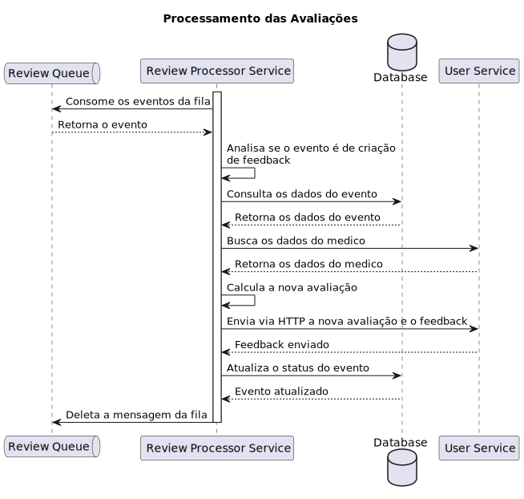

# Review Processor Service

Serviço responsável por processar todas as avaliações dos pacientes.

# Desenvolvimento Local

## Requisitos

- [Terraform](https://www.terraform.io/downloads.html)
- [Terraform Docs](https://github.com/terraform-docs/terraform-docs)
- [AWS CLI](https://aws.amazon.com/cli/)

## Implantação manual

### Atenção

Antes de implantar o cluster, certifique-se de definir as variáveis ​​de ambiente `AWS_ACCESS_KEY_ID` e `AWS_SECRET_ACCESS_KEY`.

Esteja ciente de que esse processo levará alguns minutos (~4 minutos) para ser concluído.

Para implantar o cluster manualmente, execute os seguintes comandos em ordem:

```bash
make init
make check # this will execute fmt, validate and plan
make apply
```

Para destruir o cluster, execute o seguinte comando:

```bash
make destroy
```

## Implantação Automatizada

A implantação automatizada é acionada por uma GitHub Action.

# Diagramas

## Processamento das Avaliações



# Licença

Este projeto é licenciado sob a Licença MIT - veja o arquivo [LICENSE](LICENSE) para detalhes.